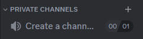
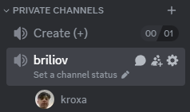

# PrivatesVoiceChannels
EmbedGenerator is a free, open-source, extensible bot for Discord servers, built on top of <a href="https://github.com/DisnakeDev/disnake">disnake.py</a>. This bot is generally self-hosted either on a dedicated server (like a Raspberry Pi) or general cloud hosting like AWS etc. You can think of this bot as privacy focused, as you are in total control of the code, so you can be sure that your information is secure.

## Features:
This bot has been in development since 2024!

### Events

#### When bot has been connected to server
When a bot has connected to a server, its owner will be notified \
  

#### When bot has been starting
1. Clears private categories on servers when the bot starts
2. A new category and voice channel "Create a room (+)" will also be created if they do not exist \
  

#### When a user is connected to "Create Channel"
1. A new voice channel will be created for them
2. They will be moved to that channel  
  
3. They will receive a notification that the channel has been created  
  

#### When the owner of a closed channel leaves the channel
1) If there are still users in the room, the next user gets access 
  Also new owner will be notification

2) If there are no users in the room, the room is deleted

### General Commands

### Usage examples

## Installation
This bot runs on [Python](https://www.python.org/)
  You will need at least python 3.10

### Windows
1. Install [Python](https://www.python.org/)
2. Activate venv in console `python -m venv venv`
3. Install all needed packages `pip install -r requirements.txt`
  You can also delete `requirements.txt` after
4. Configurate `.env` (Add your token)
5. Run `python main.py` to start bot

### Running long term
Once you've setup your keys and checked that the features you want are working, you have a couple of options for running the bot.

### Self hosted
You could run the bot alongside everything else on your pc. 
However, it's probably a good idea to run your bot on a separate computer such as a linux server or a Raspberry Pi so it does not interfere with your normal operations and to keep it running even if you were to sleep or shutdown your PC. 

### Cloud Hosted
There is a number of cloud hosting providers that can run small Python applications like this. The following have been tested to work, you'll have to extrapolate if you want to use some other provider (AWS, etc)

### Running on Heroku
- Create heroku account, install heroku-cli, create a new Dyno.
- Git clone the repo and follow the instructions in the Deploy section to setup pushing to heroku
- Go to settings and setup Config Vars the name of the vars are exactly the same as the auth.json file. You **DO NOT** need the quotes around the values in config vars
- Run `heroku scale worker=1` in the bot installation directory to run the bot as a worker rather than a webserver.

